<h1 align='center'>GitHub 统计终端样式</h1>
<p align='center'>动态生成看起来像终端界面的 GitHub 统计信息 </p>

<p align="center" >
  <a href="https://github.com/qichenxiaoni/Github-Stats-Terminal/actions/workflows/main.yml">
    
  </a>
</p>

<p align='center'>
  
</p>

## 使用方法

1. 使用此模板创建新存储库或单击 [此处](https://github.com/yogeshwaran01/github-stats-terminal-style/generate) 创建。
2. 创建个人访问令牌。查看[此链接](https://github.com/settings/tokens)以创建个人访问令牌。
3. 将新存储库机密添加到您的存储库。密钥的名称必须是`GHT`，值是您的个人访问令牌 (PAT)。查看此~~[链接](https://github.com/settings/tokens)~~以添加新的存储库机密。

该文件`github_stats.svg`是您的github统计信息的svg图像。您可以复制图像的链接并在任何地方使用它。默认情况下，它每天更新一次，您也可以通过使用[Cron Generator](https://crontab.guru/)来更改位于`.github/workflows/main.yml`中的`- cron`的属性值。

## 主题

现在只有九个主题可用。默认情况下，ubuntu 主题。您可以通过更改文件中的命令来更改主题 `/.github/workflows/main.yml`。

```bash
node updater.js ${{ github.repository_owner }} <themeName>
```

对于随机主题，无需提及任何参数

|                           **Theme Sample**                            | **Theme Name** |         **Theme Sample**        |  **ThemeName** |
| :-------------------------------------------------------------------: | :------------: | :------------------------------:| :-------------: |
|            |     ubuntu     |   |   hacker   |
|                |      atom      |   |   googledark   |
|          |    default     |  |  googlelight   |
|          |    dracula     |      |    monokai     |
|            |     github     |   |   powershell   |

## 投稿

欢迎贡献、发布和拉取请求

## 学分
Svg 生成于 [termtosvg](https://github.com/nbedos/termtosvg)